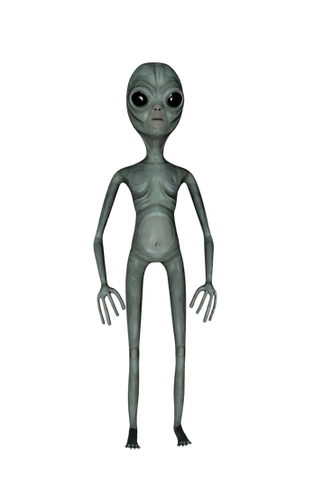
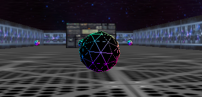

#  🌀 Alien Annihilator
A shooting video game created using three.js and Typescript.

Alien Annihilator is a videogame developed in order to fulfill the challenge of creating a "2.5D game". a 2.5D game is an approach to developing a simulation of a 3D game without a 3D graphics engine, just by simulating the depth sensation through the perspective control done by a bidimentional model.

## Problem

The current videogame industry is achieving very realistic games or huge animations. Although, those junior developers which want to explore from the basis of graphic computing are supposed to handle complicated concepts in advance game developing tools. 

## Solution

Therefore, we are motivating those people to deal with graphic computing by doing it for web environments. Our game is about an space explorer which lost his spaceship crewe at an alien attack. Now, our space explorer has to annihilate those aliens to arrive to the safe place where another tripulation is wating for him.

## Design and previews approaches.

as an inspiration of game design we took the look of those first releases of DOOM. In fact out approach is very similar to DOOM because is also in space, but we have a 3D environmen supported by THREE JS and VUE, which enables us to handle three dimentional objects and their animations. Hence, we have the good thing about both worls (2d and 3d): We have the retro vibe in the textures and we interact with 3d objects. This is perfect to build a game which doesn't need a lot of resources so we can deal with achieving the best performance.

## Our game




This is how it was suppose to look the alien but we had to be recursive with another approach: 



But, see it by yourself. **To play the game you have to** 

1. clone the repository by running the command


```console
git clone https://github.com/ToxicSSJ/alien-annihilator.git
```


2. run the following command to download the dependencies 

```console
npm i
```
3. run the following command to run the project

```console
npm run dev
```

4. copy the next [link](http://localhost:3000/) into your browser 


## Conclutions

- In order to get a better performance you have to be carefull with programming and debugging because the waste of resources is evident in this kind of developments.
- This development enabled a lot of different skills related with scene composition, phisics engine, light issues and matrix operations which demonstrates how this challenge represents a big research on graphic computing concepts.